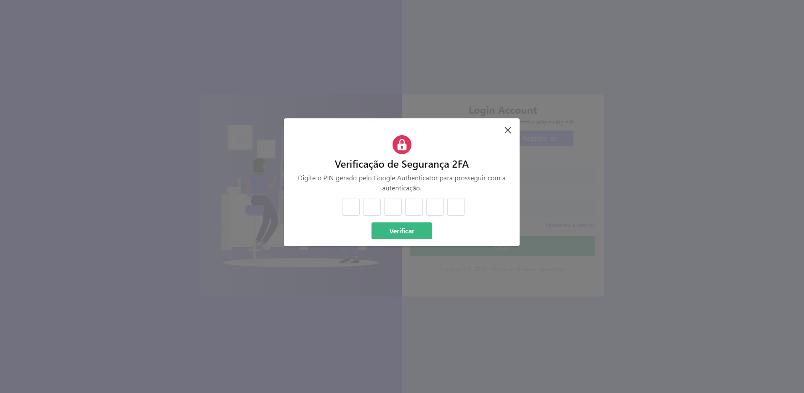
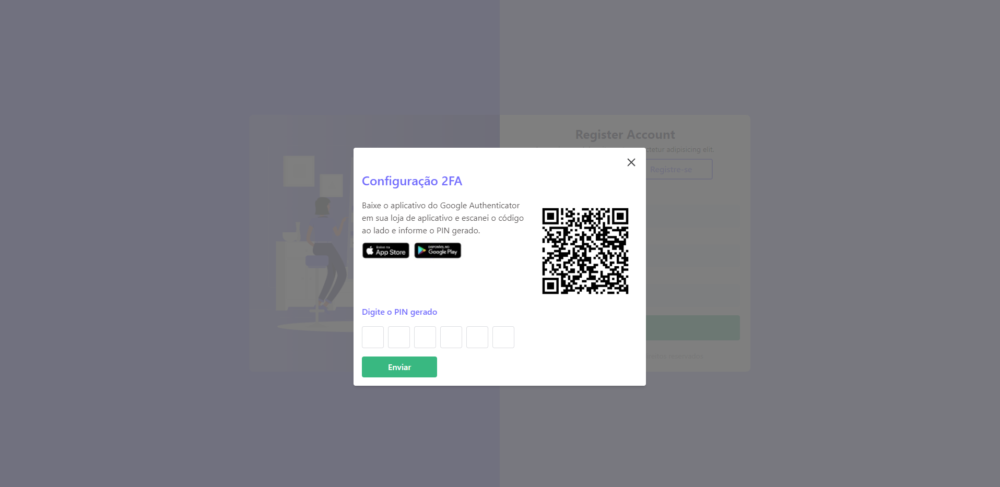

# Autenticação 2fa Frontend

#### Crie um arquivo .env

**Exemplo:**

```
VITE_URL_API = http://localhost:9090

```

## :muscle: Execução

#### Execute

```bash
npm i
```

#### Starta a aplicação

```bash
npm run dev
```

## :crossed_fingers: Algumas fotinhas :)

### Login

<p align="center">
    
</p>

### Modal de Confirmação Login

<p align="center">
    
</p>

### Register

<p align="center">
    
</p>

### Modal de Confirmação Register

<p align="center">
    
</p>

By Talita Araujo :wink::purple_heart:
